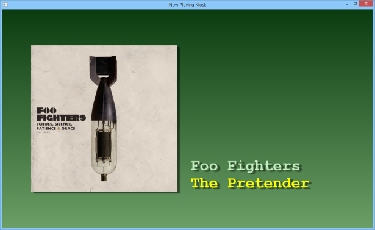

About
=====

This repository contains a small kiosk application for Windows that can be used 
to display the details and cover image of a track currently being played 
in a supported media player.

Features
--------
- Completely skinnable interface using XAML
- Cover images are automatically downloaded and cached locally
- Supported media players: Spotify

Requirements
------------
- Microsoft .NET Framework 4.0+

Usage Notes
-----------
Simply execute `NowPlayingKiosk.exe`. When a supported media player 
is playing back something, it will be detected automatically at runtime.

To customize the layout to your liking, simply modify the `skin.xaml` located 
in the skin folder. For more details on XAML, please refer to: 
http://msdn.microsoft.com/en-us/library/ms747122(v=vs.110).aspx